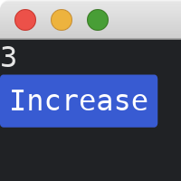

# Changing Displaying Content

To change the content in [view](https://docs.iced.rs/iced/trait.Sandbox.html#tymethod.view) dynamically, we can do the following:

* Add some fields (e.g., `counter`) to the main struct `MyApp`.
* Display the fields in [view](https://docs.iced.rs/iced/trait.Sandbox.html#tymethod.view) (e.g., `text(self.counter)`).
* Produce some messages in [view](https://docs.iced.rs/iced/trait.Sandbox.html#tymethod.view) (e.g., `button(...).on_press(MyAppMessage::ButtonPressed)`).
* Update the fields when messages are received in [update](https://docs.iced.rs/iced/trait.Sandbox.html#tymethod.update) (e.g., `self.counter += 1`).

```rust
use iced::{
    widget::{button, column, text},
    Sandbox, Settings,
};

fn main() -> iced::Result {
    MyApp::run(Settings::default())
}

#[derive(Debug, Clone)]
enum MyAppMessage {
    ButtonPressed,
}

struct MyApp {
    counter: usize,
}

impl Sandbox for MyApp {
    type Message = MyAppMessage;

    fn new() -> Self {
        Self { counter: 0 }
    }

    fn title(&self) -> String {
        String::from("My App")
    }

    fn update(&mut self, message: Self::Message) {
        match message {
            MyAppMessage::ButtonPressed => self.counter += 1,
        }
    }

    fn view(&self) -> iced::Element<'_, Self::Message> {
        column![
            text(self.counter),
            button("Increase").on_press(MyAppMessage::ButtonPressed),
        ]
        .into()
    }
}
```



:arrow_right:  Next: [Text](./text.md)

:blue_book: Back: [Table of contents](./../README.md)
