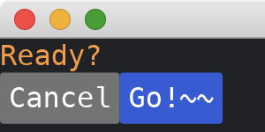

# Changing Styles

Most widgets support `style` method to change their styles.
These methods take parameters from [enums](https://doc.rust-lang.org/std/keyword.enum.html) of [theme](https://docs.rs/iced/0.12.1/iced/theme/index.html) module.
> For example, [widget::Text](https://docs.rs/iced/0.12.1/iced/widget/type.Text.html) takes [theme::Text](https://docs.rs/iced/0.12.1/iced/theme/enum.Text.html) as the parameter of its [style](https://docs.rs/iced/0.12.1/iced/advanced/widget/struct.Text.html#method.style) method, and [widget::Button](https://docs.rs/iced/0.12.1/iced/widget/struct.Button.html) takes [theme::Button](https://docs.rs/iced/0.12.1/iced/theme/enum.Button.html) as the parameter of its [style](https://docs.rs/iced/0.12.1/iced/widget/struct.Button.html#method.style) method.

Since [theme::Text](https://docs.rs/iced/0.12.1/iced/theme/enum.Text.html) implements [From\<Color>](https://docs.rs/iced/0.12.1/iced/theme/enum.Text.html#impl-From%3CColor%3E-for-Text), we can also use [Color](https://docs.rs/iced/0.12.1/iced/struct.Color.html) struct directly for the [style](https://docs.rs/iced/0.12.1/iced/advanced/widget/struct.Text.html#method.style) method of [widget::Text](https://docs.rs/iced/0.12.1/iced/widget/type.Text.html).

```rust
use iced::{
    widget::{button, column, row, text},
    Color, Element,
};

fn main() -> iced::Result {
    iced::application("changing_styles", MyApp::update, MyApp::view)
        .theme(MyApp::theme)
        .run()
}

struct MyApp {
    _state: String,
}


impl Default for MyApp {
    fn default() -> Self {
        MyApp::new()
    }
}

#[derive(Debug, Clone)]

enum Message {
    DummyMessage,
}

impl MyApp {
    fn new() -> Self {
        Self {
            _state: String::new(),
        }
    }
  
    fn update(&mut self, _message: Message) {
        todo!()
    }
  
    fn theme(&self) -> iced::Theme {
        iced::Theme::Dark
    }

    fn view(&self) -> Element<Message> {
        column!(
            text("Ready?").color(Color::from_rgb(1., 0.6, 0.2)),
            row![
                button("Cancel")
                    .style(button::secondary)
                    .on_press(Message::DummyMessage),
                button("Go!~~")
                    .style(button::primary)
                    .on_press(Message::DummyMessage)
            ]
        )
        .into()
    }
}
```



:arrow_right:  Next: [Custom Styles](./custom_styles.md)

:blue_book: Back: [Table of contents](./../README.md)
