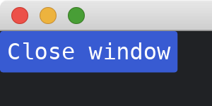

# Closing The Window On Demand

This tutorial follows the [previous tutorial](./changing_the_window_dynamically.md).
We use the [close](https://docs.rs/iced/0.12.1/iced/window/fn.close.html) function in [window](https://docs.rs/iced/0.12.1/iced/window/index.html) module to close the window.
This is also done by returning the [Command](https://docs.rs/iced/0.12.1/iced/struct.Command.html) obtained by the [close](https://docs.rs/iced/0.12.1/iced/window/fn.close.html) function.

Similar to the [resize](https://docs.rs/iced/0.12.1/iced/window/fn.resize.html) function, the [close](https://docs.rs/iced/0.12.1/iced/window/fn.close.html) function also needs an ID of the window.
We pass [window::Id::MAIN](https://docs.rs/iced/0.12.1/iced/window/struct.Id.html#associatedconstant.MAIN) for the ID.

```rust
use iced::{
    widget::{button, row},
    window, Element, Task,
};

fn main() -> iced::Result {
    iced::application("closing the window on demand", MyApp::update, MyApp::view).run()
}

struct MyApp {} 

impl Default for MyApp {
    fn default() -> Self {
        MyApp::new().0
    }
}

#[derive(Debug, Clone)]
enum Message {
    CloseWindow,
}

impl MyApp {
    fn new() -> (Self, Task<Message>) {
        (Self {}, Task::none())
    }

    fn update(&mut self, message: Message) -> Task<Message> {
        match message {
            Message::CloseWindow => return window::get_oldest().and_then(window::close),
        }
    }

    fn view(&self) -> Element<Message> {
        row!(button("Close window").on_press(Message::CloseWindow),).into()
    }
}
```



:arrow_right:  Next: [On Pressed/Released Of Some Widgets](./on_pressed_released_of_some_widgets.md)

:blue_book: Back: [Table of contents](./../README.md)
