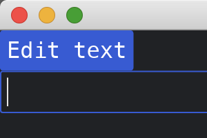

# Controlling Widgets By Commands

We can use [Command](https://docs.iced.rs/iced/struct.Command.html) to control widgets.
Some widgets have [functions](https://doc.rust-lang.org/stable/book/ch03-03-how-functions-work.html) to change their behavior.
These [functions](https://doc.rust-lang.org/stable/book/ch03-03-how-functions-work.html) are located at their respective modules.
For example, [focus](https://docs.iced.rs/iced/widget/text_input/fn.focus.html) is a function in [text_input](https://docs.iced.rs/iced/widget/text_input/index.html) module that makes a [TextInput](https://docs.iced.rs/iced/widget/text_input/struct.TextInput.html) gaining the focus.
This function takes a parameter [text_input::Id](https://docs.iced.rs/iced/widget/text_input/struct.Id.html), which can be specified by [id](https://docs.iced.rs/iced/widget/text_input/struct.TextInput.html#method.id) method of [TextInput](https://docs.iced.rs/iced/widget/text_input/struct.TextInput.html).
The function returns a [Command](https://docs.iced.rs/iced/struct.Command.html) and we can return the [Command](https://docs.iced.rs/iced/struct.Command.html) in [update](https://docs.iced.rs/iced/application/trait.Application.html#tymethod.update) or [new](https://docs.iced.rs/iced/application/trait.Application.html#tymethod.new) methods of [Application](https://docs.iced.rs/iced/application/trait.Application.html).

```rust
use iced::{
    executor,
    widget::{button, column, text_input},
    Application, Command, Settings,
};

fn main() -> iced::Result {
    MyApp::run(Settings::default())
}

const MY_TEXT_ID: &str = "my_text";

#[derive(Debug, Clone)]
enum MyAppMessage {
    EditText,
    UpdateText(String),
}

struct MyApp {
    some_text: String,
}

impl Application for MyApp {
    type Executor = executor::Default;
    type Message = MyAppMessage;
    type Theme = iced::Theme;
    type Flags = ();

    fn new(_flags: Self::Flags) -> (Self, iced::Command<Self::Message>) {
        (
            Self {
                some_text: String::new(),
            },
            Command::none(),
        )
    }

    fn title(&self) -> String {
        String::from("My App")
    }

    fn update(&mut self, message: Self::Message) -> iced::Command<Self::Message> {
        match message {
            MyAppMessage::EditText => return text_input::focus(text_input::Id::new(MY_TEXT_ID)),
            MyAppMessage::UpdateText(s) => self.some_text = s,
        }
        Command::none()
    }

    fn view(&self) -> iced::Element<'_, Self::Message, iced::Renderer<Self::Theme>> {
        column![
            button("Edit text").on_press(MyAppMessage::EditText),
            text_input("", &self.some_text)
                .id(text_input::Id::new(MY_TEXT_ID))
                .on_input(MyAppMessage::UpdateText),
        ]
        .into()
    }
}
```



:arrow_right:  Next: [Batch Commands](./batch_commands.md)
