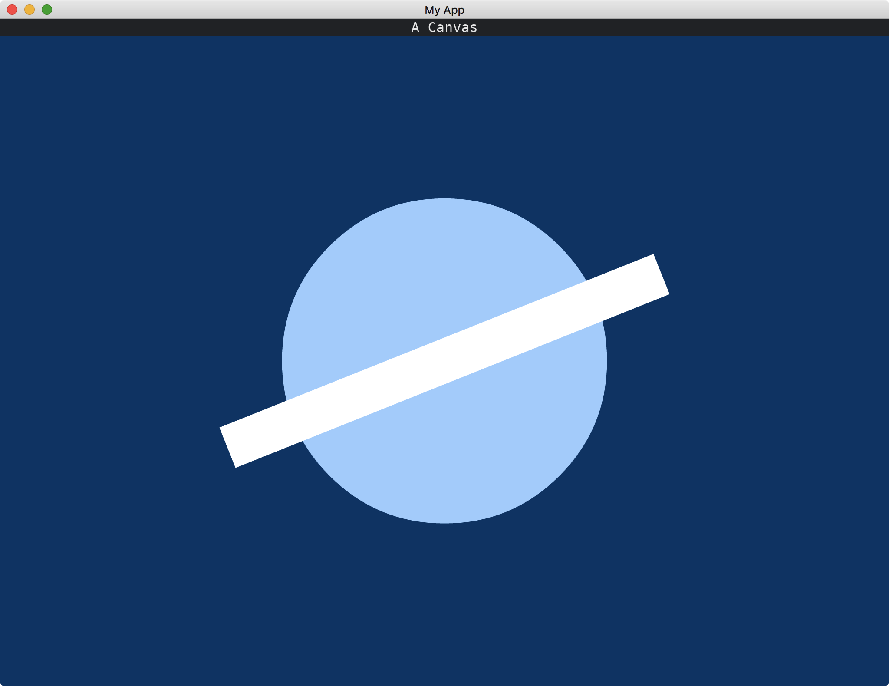

# Drawing With Caches

Previously, we mentioned that [Program](https://docs.rs/iced/0.12.1/iced/widget/canvas/trait.Program.html) has the method [draw](https://docs.rs/iced/0.12.1/iced/widget/canvas/trait.Program.html#tymethod.draw) that every time the corresponding [Canvas](https://docs.rs/iced/0.12.1/iced/widget/canvas/struct.Canvas.html) needed to be re-drawn, the method is called.
However, if the shapes of the [Canvas](https://docs.rs/iced/0.12.1/iced/widget/canvas/struct.Canvas.html) remain unchanged, it is not performant to re-draw all these shapes.
Instead, we store an image of these shapes in a [Cache](https://docs.rs/iced/0.12.1/iced/widget/canvas/struct.Cache.html), and we draw this cache when the [draw](https://docs.rs/iced/0.12.1/iced/widget/canvas/trait.Program.html#tymethod.draw) method of [Program](https://docs.rs/iced/0.12.1/iced/widget/canvas/trait.Program.html) is called.

To do so, we declare a field of type [Cache](https://docs.rs/iced/0.12.1/iced/widget/canvas/struct.Cache.html) in our app

```rust
struct MyApp {
    cache: Cache,
}
```

and initialize it.

```rust
fn new() -> Self {
    Self {
        cache: Cache::new(),
    }
}
```

In the [draw](https://docs.rs/iced/0.12.1/iced/widget/canvas/trait.Program.html#tymethod.draw) method, instead of creating a new [Frame](https://docs.rs/iced/0.12.1/iced/widget/canvas/enum.Frame.html)

```rust
let mut frame = Frame::new(renderer, bounds.size());
// ...
vec![frame.into_geometry()]
```

we use [cache.draw](https://docs.rs/iced/0.12.1/iced/widget/canvas/struct.Cache.html#method.draw) to construct the [Geometry](https://docs.rs/iced/0.12.1/iced/widget/canvas/enum.Geometry.html).

```rust
let geometry = self.cache.draw(renderer, bounds.size(), |frame| {
    // ...
});

vec![geometry]
```

The closure `|frame| { /* ... */ }` is only called when the dimensions of the `frame` change or the cache is explicitly cleared.

In addition, previously, we implement [Program](https://docs.rs/iced/0.12.1/iced/widget/canvas/trait.Program.html) for the struct `MyProgram`.
But because we need to access the `cache` field of `MyApp`, we have to implement [Program](https://docs.rs/iced/0.12.1/iced/widget/canvas/trait.Program.html) for `MyApp`.

The full code is as follows:

```rust
use iced::{
    mouse::Cursor,
    widget::{
        canvas::{Cache, Geometry, Path, Program, Stroke},
        column, Canvas,
    },
    Color, Element, Length, Point, Rectangle, Renderer, Theme, Vector,
};

fn main() -> iced::Result {
    iced::application("drawing with caches", MyApp::update, MyApp::view).run()
}
  
struct MyApp {
    cache: Cache,
}

impl Default for MyApp {
    fn default() -> Self {
        MyApp::new()
    }
}

#[derive(Debug, Clone)]
enum Message {
    _Message1,
}

impl MyApp {
    fn new() -> Self {
        Self {
            cache: Cache::new(),
        }
    }

    fn update(&mut self, _message: Message) {
        todo!()
    }

    fn view(&self) -> Element<Message> {
        column!(
            "A Canvas",
            Canvas::new(self).width(Length::Fill).height(Length::Fill)
        )
        .into()
    }
}

impl<Message> Program<Message> for MyApp {
    type State = ();
  
    // Required method
    fn draw(
        &self,
        _state: &Self::State,
        renderer: &Renderer,
        _theme: &Theme,
        bounds: Rectangle,
        _cursor: Cursor,
    ) -> Vec<Geometry> {
        let geometry = self.cache.draw(renderer, bounds.size(), |frame| {
            frame.fill_rectangle(Point::ORIGIN, bounds.size(), Color::from_rgb(0.0, 0.2, 0.4));
            frame.fill(
                &Path::circle(frame.center(), frame.width().min(frame.height()) / 4.0),
                Color::from_rgb(0.6, 0.8, 1.0),
            );
  
            // Draws the stroke of the given Path on the Frame with the provided style.
            frame.stroke(
                &Path::line(
                    // Note: the stroke won't scale with screen zoom.
                    frame.center() + Vector::new(-250.0, 100.0),
                    frame.center() + Vector::new(250.0, -100.0),
                ),
                Stroke {
                    style: Color::WHITE.into(),
                    width: 50.0,
                    ..Default::default()
                },
            );
        });
        vec![geometry]
    }
}
```



:arrow_right:  Next: [Drawing Widgets](./drawing_widgets.md)

:blue_book: Back: [Table of contents](./../README.md)
