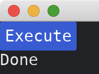

# Executing Custom Commands

[Commands](https://docs.rs/iced/0.12.1/iced/struct.Command.html) can help us executing asynchronous functions.
To do this, we need to enable one of the following features: [tokio](https://docs.rs/crate/iced/0.12.1/features#tokio), [async-std](https://docs.rs/crate/iced/0.12.1/features#async-std), or [smol](https://docs.rs/crate/iced/0.12.1/features#smol).
The corresponding asynchronous runtime ([tokio](https://crates.io/crates/tokio), [async-std](https://crates.io/crates/async-std), or [smol](https://crates.io/crates/smol)) must also be added.

Here, we use [async-std](https://crates.io/crates/async-std) as an example.
We enable [async-std](https://docs.rs/crate/iced/latest/features#async-std) feature and add [async-std](https://crates.io/crates/async-std) crate.
The `Cargo.toml` should look like this:

```toml
[dependencies]
async-std = "1.12.0"
iced = { version = "0.12.1", features = ["async-std"] }
```

We use [Command::perform](https://docs.rs/iced/0.12.1/iced/struct.Command.html#method.perform) to execute an asynchronous function.
The first parameter of [Command::perform](https://docs.rs/iced/0.12.1/iced/struct.Command.html#method.perform) is an asynchronous function, and the second parameter is a function that returns `MyAppMessage`.
The `MyAppMessage` will be produced once the asynchronous function is done.

In the following code, we use a simple asynchronous function [async_std::task::sleep](https://docs.rs/async-std/1.12.0/async_std/task/fn.sleep.html).
When the asynchronous function finished, we will receive `MyAppMessage::Done`.

```rust
use std::time::Duration;

use iced::{
    executor,
    widget::{button, column, text},
    Application, Command, Settings,
};

fn main() -> iced::Result {
    MyApp::run(Settings::default())
}

#[derive(Debug, Clone)]
enum MyAppMessage {
    Execute,
    Done,
}

struct MyApp {
    state: String,
}

impl Application for MyApp {
    type Executor = executor::Default;
    type Message = MyAppMessage;
    type Theme = iced::Theme;
    type Flags = ();

    fn new(_flags: Self::Flags) -> (Self, iced::Command<Self::Message>) {
        (
            Self {
                state: "Ready".into(),
            },
            Command::none(),
        )
    }

    fn title(&self) -> String {
        String::from("My App")
    }

    fn update(&mut self, message: Self::Message) -> iced::Command<Self::Message> {
        match message {
            MyAppMessage::Execute => {
                self.state = "Executing".into();
                return Command::perform(async_std::task::sleep(Duration::from_secs(1)), |_| {
                    MyAppMessage::Done
                });
            }
            MyAppMessage::Done => self.state = "Done".into(),
        }
        Command::none()
    }

    fn view(&self) -> iced::Element<'_, Self::Message, iced::Renderer<Self::Theme>> {
        column![
            button("Execute").on_press(MyAppMessage::Execute),
            text(self.state.as_str()),
        ]
        .into()
    }
}
```



:arrow_right:  Next: [Initializing A Different Window](./initializing_a_different_window.md)

:blue_book: Back: [Table of contents](./../README.md)
