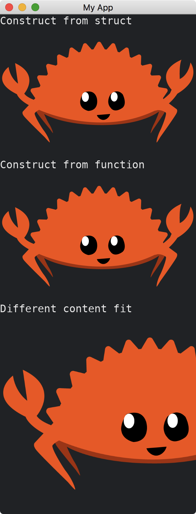

# Image

The [Image](https://docs.rs/iced/0.12.1/iced/widget/image/struct.Image.html) widget is able to display an image.
It has two methods of constructions.
We can set how to fit the image content into the widget bounds.

To use the widget, we have to enable the [image](https://docs.rs/crate/iced/0.12.1/features#image) feature.
The `Cargo.toml` dependencies should look like this:

```toml
[dependencies]
iced = { version = "0.12.1", features = ["image"] }
```

Assume we have an image named `ferris.png` in the project root directory, i.e., the image has the path `my_project/ferris.png` where `my_project` is the name of our project.

```rust
use iced::{
    widget::{column, image, text, Image},
    ContentFit, Sandbox, Settings,
};

fn main() -> iced::Result {
    MyApp::run(Settings::default())
}

struct MyApp;

impl Sandbox for MyApp {
    type Message = ();

    fn new() -> Self {
        Self
    }

    fn title(&self) -> String {
        String::from("My App")
    }

    fn update(&mut self, _message: Self::Message) {}

    fn view(&self) -> iced::Element<'_, Self::Message> {
        column![
            text("Construct from struct"),
            Image::new("ferris.png"),
            text("Construct from function"),
            image("ferris.png"),
            text("Different content fit"),
            image("ferris.png").content_fit(ContentFit::Cover),
        ]
        .into()
    }
}
```



:arrow_right:  Next: [Svg](./svg.md)

:blue_book: Back: [Table of contents](./../README.md)
