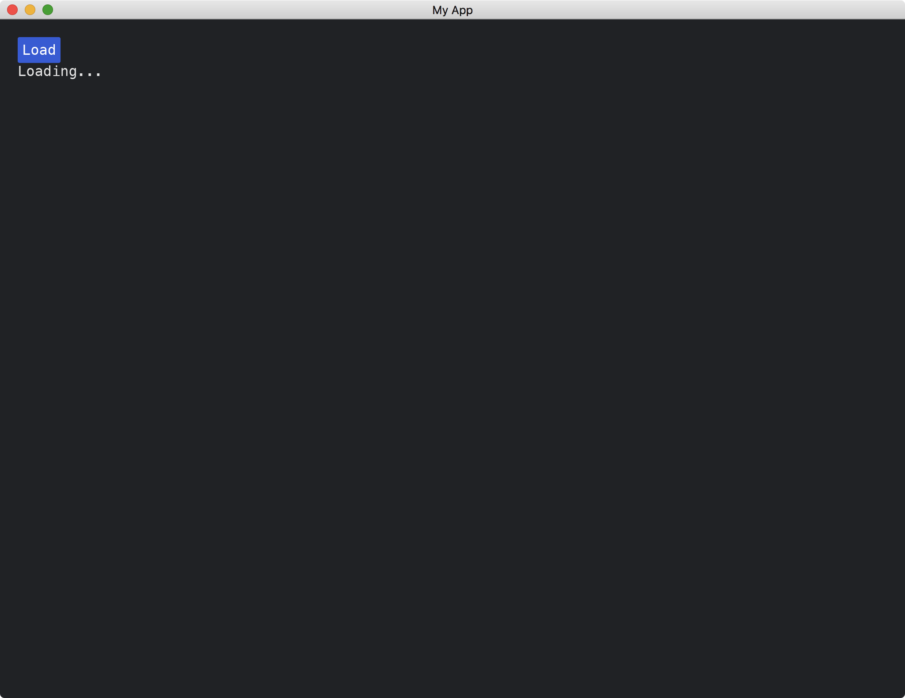
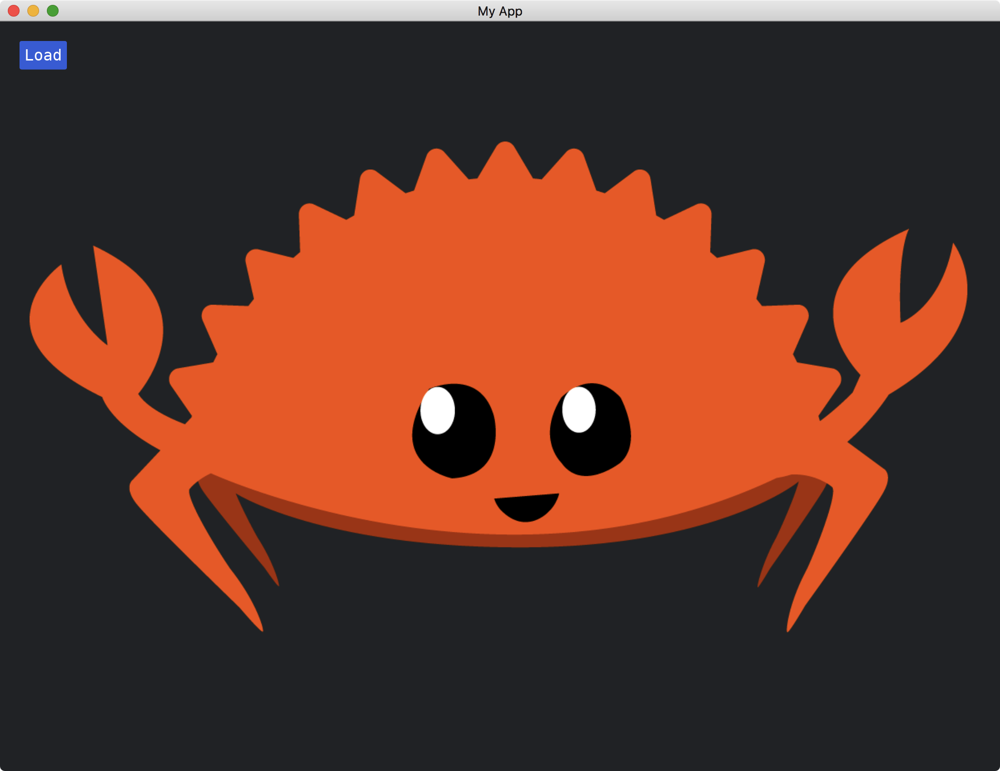

# Loading Images Asynchronously

In the previous tutorials, we introduced how to use [Application](https://docs.rs/iced/0.12.1/iced/application/trait.Application.html) to execute an asynchronous operation and how to display an image.
This tutorial combines both and demonstrates how to load an image asynchronously.

It is assumed that there is an image named `ferris.png` in the Cargo project root directory.

To use asynchronous and image functions, we have to include the corresponding asynchronous library and enable the corresponding features.
The dependencies of the `Cargo.toml` file should look like this:

```toml
[dependencies]
iced = {version = "0.13.1", features = ["tokio"] }
tokio = {version = "1.43.0", features = ["full"]}
```

Our app will have three states: *start*, *loading* and *loaded*.
We use two fields to encode the three states.

```rust
struct MyApp {
    image_handle: Option<Handle>,
    show_container: bool,
}
```

When the state is

* **start**: `image_handle` is `None` and `show_container` is false;
* **loading**: `image_handle` is `None` and `show_container` is true;
* **loaded**: `image_handle` is `Some(...)` and `show_container` is true.

The app begins in the *start* state.

The app always shows a button that is for loading the `ferris.png` image.
In the *start* state, the app shows no additional widget.
In the *loading* state, the app shows the text `Loading...`.
And in the *loaded* state, the app shows the image.

```rust
fn view(&self) -> iced::Element<Self::Message> {
    column![
        button("Load").on_press(MyMessage::Load),
        if self.show_container {
            match &self.image_handle {
                Some(h) => container(image(h.clone())),
                None => container("Loading..."),
            }
        } else {
            container("")
        },
    ]
    .padding(20)
    .into()
}
```

We have two messages for the app:

```rust
#[derive(Debug, Clone)]
enum MyMessage {
    Load,
    Loaded(Vec<u8>),
}
```

When the button is pressed, the app triggers a `Load` message to load the image.
And when the image is loaded, the app triggers a `Loaded(...)` message.

The image will be loaded asynchronously.

```rust
fn update(&mut self, message: Self::Message) -> iced::Command<Self::Message> {
    match message {
        MyMessage::Load => {
            self.show_container = true;
            return Command::perform(
                async {
                    let mut file = File::open("ferris.png").await.unwrap();
                    let mut buffer = Vec::new();
                    file.read_to_end(&mut buffer).await.unwrap();
                    buffer
                },
                MyMessage::Loaded,
            );
        }
        MyMessage::Loaded(data) => self.image_handle = Some(Handle::from_memory(data)),
    }
    Command::none()
}
```

The full code is as follows:

```rust
use iced::{
    widget::{button, column, container, image, image::Handle},
    Element, Task,
};
use tokio::{fs::File, io::AsyncReadExt};
  
fn main() -> iced::Result {
    iced::application("loading images asynchronously", MyApp::update, MyApp::view).run()
}

struct MyApp {
    image_handle: Option<Handle>,
    show_container: bool,
}

impl Default for MyApp {
    fn default() -> Self {
        MyApp::new().0
    }
}

#[derive(Debug, Clone)]
enum Message {
    Load,
    Loaded(Vec<u8>),
}

impl MyApp {
    fn new() -> (Self, Task<Message>) {
        (
            Self {
                image_handle: None,
                show_container: false,
            },
            Task::none(),
        )
    }

    fn update(&mut self, message: Message) -> Task<Message> {
        match message {
            Message::Load => {
                self.show_container = true;
                return Task::perform(
                    async {
                        let mut file = File::open("ferris.png").await.unwrap();
                        let mut buffer = Vec::new();
                        file.read_to_end(&mut buffer).await.unwrap();
                        buffer
                    },
                    Message::Loaded,
                );
            }
            Message::Loaded(data) => {
                self.image_handle = Some(Handle::from_bytes(data));
            }
        }
        Task::none()
    }

    fn view(&self) -> Element<Message> {
        column![
            button("Load").on_press(Message::Load),
            if self.show_container {
                match &self.image_handle {
                    Some(h) => container(image(h.clone())),
                    None => container("Loading"),
                }
            } else {
                container("")
            }
        ]
        .padding(20)
        .into()
    }
}
```

State of *start*:


State of *loading*:



State of *loaded*:



<!-- :arrow_right:  Next:  -->

:blue_book: Back: [Table of contents](./../README.md)
