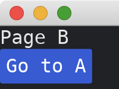

# More Than One Page

To have multiple pages, we can add a field `page` to the main struct `MyApp`.
The field `page` is an [enum](https://doc.rust-lang.org/std/keyword.enum.html) defined by us that decides what to display in [view](https://docs.rs/iced/0.12.1/iced/trait.Sandbox.html#tymethod.view) method of the [Sandbox](https://docs.rs/iced/0.12.1/iced/trait.Sandbox.html).

```rust
use iced::{
    widget::{button, column, text},
    Element,
};

fn main() -> iced::Result {
    iced::application("more than one page", MyApp::update, MyApp::view).run()
}

#[derive(Debug, Clone, Copy, PartialEq, Eq)]
enum Page {
    A,
    B,
}

struct MyApp {
    page: Page,
}

impl Default for MyApp {
    fn default() -> Self {
        MyApp::new()
    }
}

#[derive(Debug, Clone)]
enum Message {
    GoToBButtonPressed,
    GoToAButtonPressed,
}

impl MyApp {
    fn new() -> Self {
        Self { page: Page::A }
    }

    fn update(&mut self, message: Message) {
        self.page = match message {
            Message::GoToAButtonPressed => Page::A,
            Message::GoToBButtonPressed => Page::B,
        }
    }

    fn view(&self) -> Element<Message> {
        match self.page {
            Page::A => {
                column![
                    text("Page A"),
                    button("Go to B").on_press(Message::GoToBButtonPressed),
                ]
            }
            Page::B => {
                column![
                    text("Page B"),
                    button("Go to A").on_press(Message::GoToAButtonPressed),
                ]
            }
        }
        .into()
    }
}
```

Page A:


And page B:



:arrow_right:  Next: [Memoryless Pages](./memoryless_pages.md)

:blue_book: Back: [Table of contents](./../README.md)
