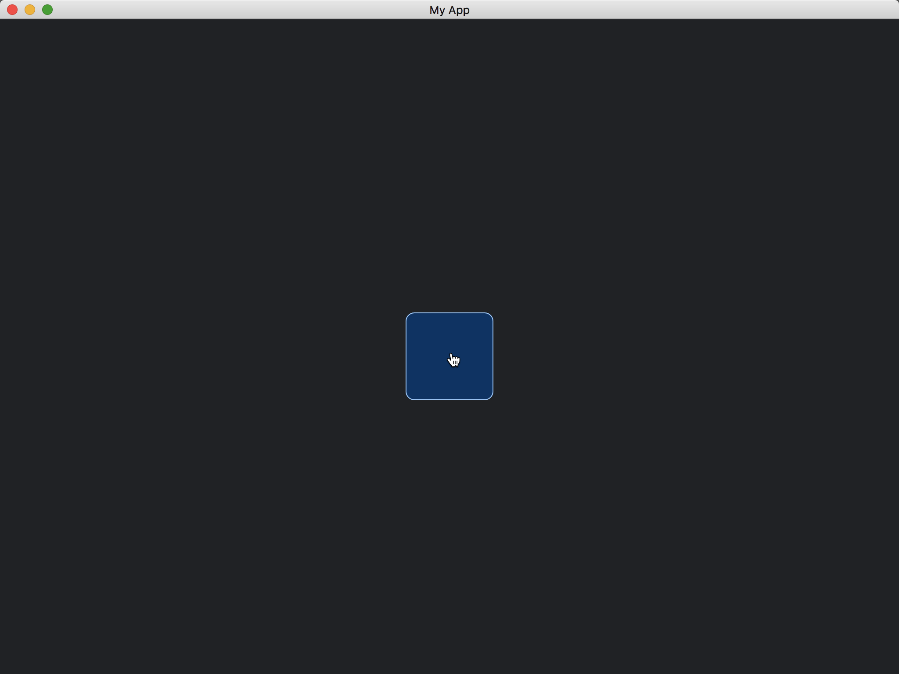

# Mouse Pointer Over Widgets

To change the mouse pointer based on the requirement of our widgets, we can use the [mouse_interaction](https://docs.rs/iced/latest/iced/advanced/widget/trait.Widget.html#method.mouse_interaction) method of [Widget](https://docs.rs/iced/latest/iced/advanced/widget/trait.Widget.html).

```rust
fn mouse_interaction(
    &self,
    _state: &Tree,
    layout: Layout<'_>,
    cursor: mouse::Cursor,
    _viewport: &Rectangle,
    _renderer: &Renderer,
) -> mouse::Interaction {
    if cursor.is_over(layout.bounds()) {
        mouse::Interaction::Pointer
    } else {
        mouse::Interaction::Idle
    }
}
```

The method returns [Interaction](https://docs.rs/iced/latest/iced/mouse/enum.Interaction.html), which specifies the type of the mouse pointer.
In our example, we specify [Interaction::Pointer](https://docs.rs/iced/latest/iced/mouse/enum.Interaction.html#variant.Pointer) when the mouse is over the widget.

The full code is as follows:

```rust
use iced::{
    advanced::{
        layout, mouse,
        renderer::{self, Quad},
        widget::Tree,
        Layout, Widget,
    },
    widget::container,
    Color, Element, Length, Rectangle, Sandbox, Settings,
};

fn main() -> iced::Result {
    MyApp::run(Settings::default())
}

struct MyApp;

impl Sandbox for MyApp {
    type Message = ();

    fn new() -> Self {
        Self
    }

    fn title(&self) -> String {
        String::from("My App")
    }

    fn update(&mut self, _message: Self::Message) {}

    fn view(&self) -> iced::Element<'_, Self::Message> {
        container(MyWidget)
            .width(Length::Fill)
            .height(Length::Fill)
            .center_x()
            .center_y()
            .into()
    }
}

struct MyWidget;

impl<Message, Renderer> Widget<Message, Renderer> for MyWidget
where
    Renderer: iced::advanced::Renderer,
{
    fn width(&self) -> Length {
        Length::Shrink
    }

    fn height(&self) -> Length {
        Length::Shrink
    }

    fn layout(&self, _renderer: &Renderer, _limits: &layout::Limits) -> layout::Node {
        layout::Node::new([100, 100].into())
    }

    fn draw(
        &self,
        _state: &Tree,
        renderer: &mut Renderer,
        _theme: &Renderer::Theme,
        _style: &renderer::Style,
        layout: Layout<'_>,
        _cursor: mouse::Cursor,
        _viewport: &Rectangle,
    ) {
        renderer.fill_quad(
            Quad {
                bounds: layout.bounds(),
                border_radius: 10.0.into(),
                border_width: 1.0,
                border_color: Color::from_rgb(0.6, 0.8, 1.0),
            },
            Color::from_rgb(0.0, 0.2, 0.4),
        );
    }

    fn mouse_interaction(
        &self,
        _state: &Tree,
        layout: Layout<'_>,
        cursor: mouse::Cursor,
        _viewport: &Rectangle,
        _renderer: &Renderer,
    ) -> mouse::Interaction {
        if cursor.is_over(layout.bounds()) {
            mouse::Interaction::Pointer
        } else {
            mouse::Interaction::Idle
        }
    }
}

impl<'a, Message, Renderer> From<MyWidget> for Element<'a, Message, Renderer>
where
    Renderer: iced::advanced::Renderer,
{
    fn from(widget: MyWidget) -> Self {
        Self::new(widget)
    }
}
```



<!-- :arrow_right:  Next:  -->

:blue_book: Back: [Table of contents](./../README.md)
