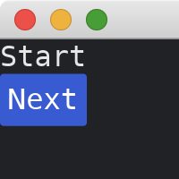
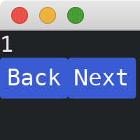

# Navigation History

This tutorial follows the [previous tutorial](./passing_parameters_across_pages.md).
The framework introduced in the [previous tutorial](./passing_parameters_across_pages.md) can be extended to handle page navigation history, which is capable of restoring past pages.

Instead of keeping a single page in the main struct `MyApp`, we can keep a [Vec](https://doc.rust-lang.org/std/vec/struct.Vec.html) of pages.
We control how the [Vec](https://doc.rust-lang.org/std/vec/struct.Vec.html) would change in [update](https://docs.rs/iced/0.12.1/iced/trait.Sandbox.html#tymethod.update) method of [SandBox](https://docs.rs/iced/0.12.1/iced/trait.Sandbox.html).
The communication between [update](https://docs.rs/iced/0.12.1/iced/trait.Sandbox.html#tymethod.update) of [Sandbox](https://docs.rs/iced/0.12.1/iced/trait.Sandbox.html) and `update` of `Page` trait is through a custom [enum](https://doc.rust-lang.org/std/keyword.enum.html) `Navigation`.

```rust
use iced::{
    widget::{button, column, text, row},
    Element,
};

fn main() -> iced::Result {
    iced::application("My App", MyApp::update, MyApp::view).run()
}

#[derive(Debug, Clone)]
enum MyAppMessage {
    PageA(PageAMessage),
    PageB(PageBMessage),
}

enum Navigation {
    GoTo(Box<dyn Page>),
    Back,
    None,
}

trait Page {
    fn update(&mut self, message: Message) -> Navigation;
    fn view(&self) -> iced::Element<'_, Message>;
}

struct MyApp {
    pages: Vec<Box<dyn Page>>,
}

impl MyApp {
    fn new() -> Self {
        Self {
            pages: vec![Box::new(PageA::new())],
        }
    }
  
    fn update(&mut self, message: Message) {
        let navigation = self.pages.last_mut().unwrap().update(message);
        match navigation {
            Navigation::GoTo(p) => self.pages.push(p),
            Navigation::Back => {
                if self.pages.len() > 1 {
                    self.pages.pop();
                }
            }
            Navigation::None => {}
        }
    }

    fn view(&self) -> Element<Message> {
        self.pages.last().unwrap().view()
    }
}
```

The following is the first type of pages:

```rust
#[derive(Debug, Clone)]
enum PageAMessage {
    ButtonPressed,
}
type Ma = PageAMessage;

struct PageA;

impl PageA {
    fn new() -> Self {
        Self
    }
}

impl Page for PageA {
    fn update(&mut self, message: MyAppMessage) -> Navigation {
        if let MyAppMessage::PageA(msg) = message {
            match msg {
                PageAMessage::ButtonPressed => {
                    return Navigation::GoTo(Box::new(PageB::new(1)));
                }
            }
        }
        Navigation::None
    }

    fn view(&self) -> iced::Element<MyAppMessage> {
        column![
            text("Start"),
            button("Next").on_press(MyAppMessage::PageA(Ma::ButtonPressed)),
        ]
        .into()
    }
}
```



And the second type of pages:

```rust
#[derive(Debug, Clone)]
enum PageBMessage {
    BackButtonPressed,
    NextButtonPressed,
}
type Mb = PageBMessage;

struct PageB {
    id: u32,
}

impl PageB {
    fn new(id: u32) -> Self {
        Self { id }
    }
}

impl Page for PageB {
    fn update(&mut self, message: MyAppMessage) -> Navigation {
        if let MyAppMessage::PageB(msg) = message {
            match msg {
                PageBMessage::BackButtonPressed => return Navigation::Back,
                PageBMessage::NextButtonPressed => {
                    return Navigation::GoTo(Box::new(PageB::new(self.id + 1)))
                }
            }
        }
        Navigation::None
    }

    fn view(&self) -> iced::Element<MyAppMessage> {
        column![
            text(self.id),
            row![
                button("Back").on_press(MyAppMessage::PageB(Mb::BackButtonPressed)),
                button("Next").on_press(MyAppMessage::PageB(Mb::NextButtonPressed)),
            ],
        ]
        .into()
    }
}
```



:arrow_right:  Next: [From Sandbox To Application](./from_sandbox_to_application.md)

:blue_book: Back: [Table of contents](./../README.md)
