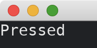
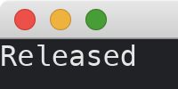

# On Pressed/Released Of Some Widgets

If we only consider mouse pressed or released events, we can use [MouseArea](https://docs.rs/iced/0.12.1/iced/widget/struct.MouseArea.html).
The [MouseArea](https://docs.rs/iced/0.12.1/iced/widget/struct.MouseArea.html) gives the widget being put in it the sense of mouse pressed/released events, even if the widget has no build-in support of the events.
For example, we can make a [Text](https://docs.rs/iced/0.12.1/iced/widget/type.Text.html) to respond to mouse pressed/released events.

```rust
use iced::{widget::mouse_area, Element};

fn main() -> iced::Result {
    iced::application("on pressed released of some widgets", MyApp::update, MyApp::view).run()
}

struct MyApp {
    state: String,
}

impl Default for MyApp {
    fn default() -> Self {
        MyApp::new()
    }
}

#[derive(Debug, Clone)]
enum Message {
    Pressed,
    Released,
}

impl MyApp {
    fn new() -> Self {
        Self {
            state: "Start".into(),
        }
    }

    fn update(&mut self, message: Message) {
        match message {
            Message::Pressed => {
                self.state = "Pressed".into();
            }
            Message::Released => {
                self.state = "Released".into();
            }
        }
    }

    fn view(&self) -> Element<Message> {
        mouse_area(self.state.as_str())
            .on_press(Message::Pressed)
            .on_release(Message::Released)
            .into()
    }
}
```

In addition to [on_press](https://docs.rs/iced/0.12.1/iced/widget/struct.MouseArea.html#method.on_press) and [on_release](https://docs.rs/iced/0.12.1/iced/widget/struct.MouseArea.html#method.on_release) methods, [MouseArea](https://docs.rs/iced/0.12.1/iced/widget/struct.MouseArea.html) also supports [on_middle_press](https://docs.rs/iced/0.12.1/iced/widget/struct.MouseArea.html#method.on_middle_press), [on_right_press](https://docs.rs/iced/0.12.1/iced/widget/struct.MouseArea.html#method.on_right_press), etc.

When the mouse is pressed:



And when the mouse is released:



:arrow_right:  Next: [Producing Messages By Mouse Events](./producing_messages_by_mouse_events.md)

:blue_book: Back: [Table of contents](./../README.md)
