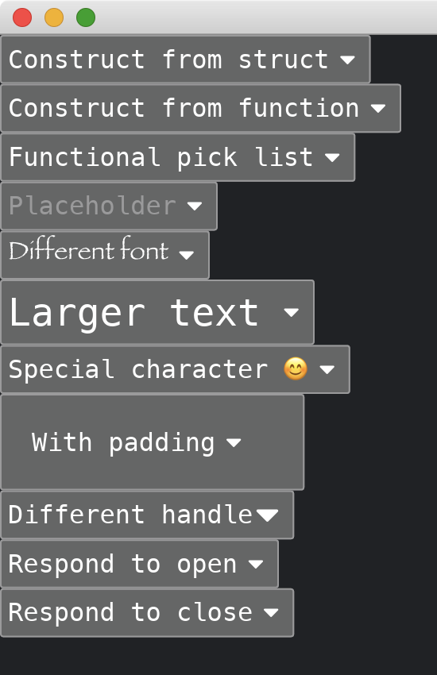

# PickList

The [PickList](https://docs.rs/iced/0.12.1/iced/widget/pick_list/struct.PickList.html) widget represents a choice among multiple values.
It has two methods of constructions.
It supports reactions to option selections and menu opening/closing.
A placeholder can be set when options are not selected yet.
It is able to change styles of the text.
We can add padding around the text inside.
We can also change the icon of the handle.

```rust
use iced::{
    font::Family,
    widget::{column, pick_list, pick_list::Handle, row, text, text::Shaping, Column, PickList},
    Font, Pixels,
};

pub fn main() -> iced::Result {
    iced::application("My app", update, view).run()
}
  
#[derive(Debug, Clone)]
  
enum MyAppMessage {
    DoNothing,
    Update3(String),
    Open10,
    Close11,
    OpenState,
    CloseState,
}

#[derive(Default)]

struct State {
    pick_list_3: Option<String>,
    info_10: String,
    info_11: String,
    info_12: String,
}

fn update(state: &mut State, message: MyAppMessage) {
    match message {
        MyAppMessage::DoNothing => {}
        MyAppMessage::Update3(s) => {
            state.pick_list_3 = Some(s);
        }
        MyAppMessage::Open10 => {
            state.info_10 = "Open".into();
        }
        MyAppMessage::Close11 => {
            state.info_11 = "Closed".into();
        }
        MyAppMessage::OpenState => {
            state.info_12 = "Open".into();
        }
        MyAppMessage::CloseState => {
            state.info_12 = "Closed".into();
        }
    }
} 

fn view(state: &State) -> Column<MyAppMessage> {
    column![
        PickList::new(
            vec!["Construct from struct"],
            Some("Construct from struct"),
            |_| MyAppMessage::DoNothing
        ),
        pick_list(
            vec!["Construct from function"],
            Some("Construct from function"),
            |_| MyAppMessage::DoNothing
        ),
        // A typical pick list
        pick_list(
            ["Other choices 1", "Other choices 2"]
                .map(|s| s.to_string())
                .to_vec(),
            state.pick_list_3.clone(),
            |s| MyAppMessage::Update3(s)
        )
        .placeholder("Functional pick list"),
        pick_list(vec!["A", "B", "C"], None::<&str>, |_| {
            MyAppMessage::DoNothing
        })
        .placeholder("Placeholder"),
        // Personalization
        pick_list(vec!["Different font"], Some("Different font"), |_| {
            MyAppMessage::DoNothing
        })
        .font(Font {
            family: Family::Fantasy,
            ..Font::DEFAULT
        }),
        pick_list(vec!["Larger text"], Some("Larger text"), |_| {
            MyAppMessage::DoNothing
        })
        .text_size(24),
        pick_list(
            vec!["Special character 😊"],
            Some("Special character 😊"),
            |_| MyAppMessage::DoNothing
        )
        .text_shaping(Shaping::Advanced),
        pick_list(vec!["With padding"], Some("With padding"), |_| {
            MyAppMessage::DoNothing
        })
        .padding(20),
        // A handle is the little triangle on the right of pick lists
        pick_list(vec!["Different handle"], Some("Different handle"), |_| {
            MyAppMessage::DoNothing
        })
        .handle(Handle::Arrow {
            size: Some(Pixels(24.))
        }),
        // When open the pick list, the word "Open" will occur on the right.
        row![
            pick_list(vec!["Respond to open"], Some("Respond to open"), |_| {
                MyAppMessage::DoNothing
            })
            .on_open(MyAppMessage::Open10),
            text(&state.info_10),
        ],
        // When close the pick list, the word "Closed" will occur on the right.
        row![
            pick_list(vec!["Respond to close"], Some("Respond to close"), |_| {
                MyAppMessage::DoNothing
            })
            .on_close(MyAppMessage::Close11),
            text(&state.info_11),
        ],
        // Detect the state of the pick list
        row![
            pick_list(vec!["Auto Detector"], Some("Auto Detector"), |_| {
                MyAppMessage::DoNothing
            })
            .on_open(MyAppMessage::OpenState)
            .on_close(MyAppMessage::CloseState),
            text(&state.info_12),
        ],
    ]
    .into()
}
```



:arrow_right:  Next: [ComboBox](./combobox.md)

:blue_book: Back: [Table of contents](./../README.md)
