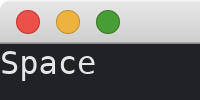

# Producing Messages By Keyboard Events

This tutorial follows from the [previous tutorial](./producing_messages_by_mouse_events.md).
Instead of capturing [Event::Mouse](https://docs.iced.rs/iced/event/enum.Event.html#variant.Mouse) and [Event::Touch](https://docs.iced.rs/iced/event/enum.Event.html#variant.Touch), we capture [Event::Keyboard](https://docs.iced.rs/iced/event/enum.Event.html#variant.Keyboard) in the [events_with](https://docs.rs/iced/latest/iced/subscription/fn.events_with.html) function.

Note: [events_with](https://docs.rs/iced/latest/iced/subscription/fn.events_with.html) will be deprecated.
If you cannot find this function, try using [listen_with](https://docs.iced.rs/iced/event/fn.listen_with.html).

```rust
use iced::{
    event::Status,
    executor,
    keyboard::{Event::KeyPressed, KeyCode},
    subscription,
    widget::text,
    Application, Event, Settings,
};

fn main() -> iced::Result {
    MyApp::run(Settings::default())
}

#[derive(Debug, Clone)]
enum MyAppMessage {
    KeyPressed(String),
}

struct MyApp {
    pressed_key: String,
}

impl Application for MyApp {
    type Executor = executor::Default;
    type Message = MyAppMessage;
    type Theme = iced::Theme;
    type Flags = ();

    fn new(_flags: Self::Flags) -> (Self, iced::Command<Self::Message>) {
        (
            Self {
                pressed_key: "".into(),
            },
            iced::Command::none(),
        )
    }

    fn title(&self) -> String {
        String::from("My App")
    }

    fn update(&mut self, message: Self::Message) -> iced::Command<Self::Message> {
        match message {
            MyAppMessage::KeyPressed(s) => self.pressed_key = s,
        }
        iced::Command::none()
    }

    fn view(&self) -> iced::Element<'_, Self::Message, iced::Renderer<Self::Theme>> {
        text(self.pressed_key.as_str()).into()
    }

    fn subscription(&self) -> iced::Subscription<Self::Message> {
        subscription::events_with(|event, status| match (event, status) {
            (
                Event::Keyboard(KeyPressed {
                    key_code: KeyCode::Enter,
                    ..
                }),
                Status::Ignored,
            ) => Some(MyAppMessage::KeyPressed("Enter".into())),
            (
                Event::Keyboard(KeyPressed {
                    key_code: KeyCode::Space,
                    ..
                }),
                Status::Ignored,
            ) => Some(MyAppMessage::KeyPressed("Space".into())),
            _ => None,
        })
    }
}
```



:arrow_right:  Next: [Producing Messages By Timers](./producing_messages_by_timers.md)
