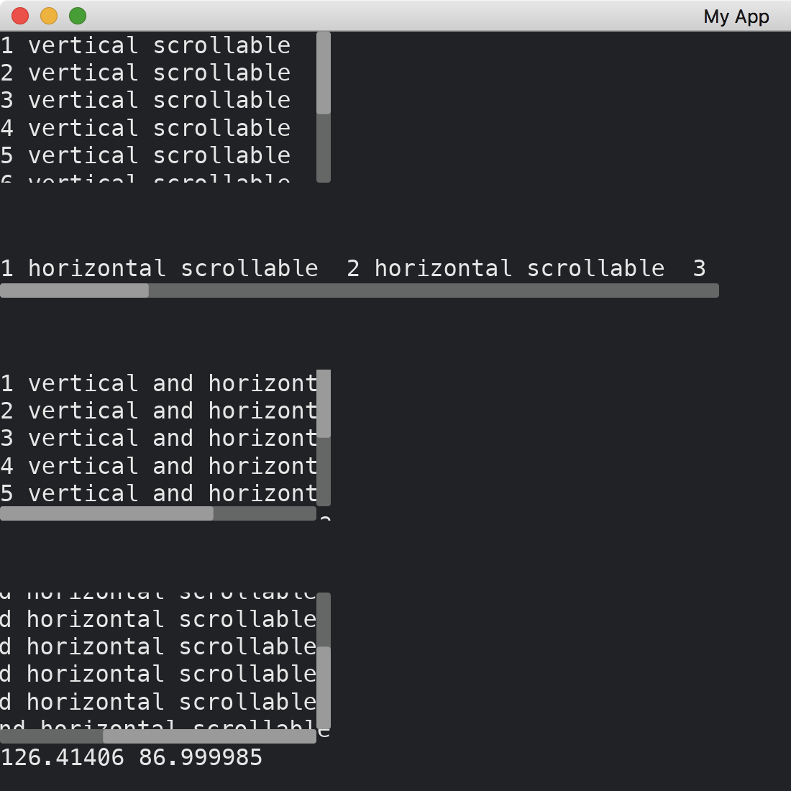

# Scrollable

When there are too many widgets, they may go beyond the boundary of the window.
[Scrollable](https://docs.rs/iced/latest/iced/widget/scrollable/struct.Scrollable.html) provides an infinite space that widgets can be navigated by scroll bars.
The scroll bars can be vertical, horizontal or both.
When the scroll bars are changed, we can also receive their scroll positions and update other widgets.

```rust
use iced::{
    widget::{
        column, row,
        scrollable::{Direction, Properties, Viewport},
        text, Scrollable,
    },
    Sandbox, Settings,
};

fn main() -> iced::Result {
    MyApp::run(Settings::default())
}

#[derive(Debug, Clone)]
enum MyMessage {
    Scrolled4(Viewport),
}

struct MyApp {
    offset4: String,
}

impl Sandbox for MyApp {
    type Message = MyMessage;

    fn new() -> Self {
        Self { offset4: "".into() }
    }

    fn title(&self) -> String {
        String::from("My App")
    }

    fn update(&mut self, message: Self::Message) {
        match message {
            MyMessage::Scrolled4(v) => {
                self.offset4 = format!("{} {}", v.absolute_offset().x, v.absolute_offset().y)
            }
        }
    }

    fn view(&self) -> iced::Element<'_, Self::Message> {
        let long_vertical_texts = column(
            (0..10)
                .map(|i| text(format!("{} vertical scrollable", i + 1)).into())
                .collect(),
        );
        let long_horizontal_texts = row((0..10)
            .map(|i| text(format!("{} horizontal scrollable  ", i + 1)).into())
            .collect());
        let long_both_texts = column(
            (0..10)
                .map(|i| text(format!("{} vertical and horizontal scrollable", i + 1)).into())
                .collect(),
        );
        let long_both_texts_2 = column(
            (0..10)
                .map(|i| text(format!("{} vertical and horizontal scrollable", i + 1)).into())
                .collect(),
        );

        column![
            Scrollable::new(long_vertical_texts)
                .width(230)
                .height(105)
                .direction(Direction::Vertical(Properties::new())),
            Scrollable::new(long_horizontal_texts)
                .width(500)
                .height(30)
                .direction(Direction::Horizontal(Properties::new())),
            Scrollable::new(long_both_texts)
                .width(230)
                .height(105)
                .direction(Direction::Both {
                    vertical: Properties::new(),
                    horizontal: Properties::new()
                }),
            column![
                Scrollable::new(long_both_texts_2)
                    .width(230)
                    .height(105)
                    .direction(Direction::Both {
                        vertical: Properties::new(),
                        horizontal: Properties::new()
                    })
                    .on_scroll(MyMessage::Scrolled4),
                text(&self.offset4),
            ],
        ]
        .spacing(50)
        .into()
    }
}
```



Instead of using [Scrollable::new](https://docs.rs/iced/latest/iced/widget/scrollable/struct.Scrollable.html#method.new), we can also use the [scrollable](https://docs.rs/iced/latest/iced/widget/fn.scrollable.html) function.

:arrow_right:  Next: [Changing Themes](./changing_themes.md)

:blue_book: Back: [Table of contents](./../README.md)
