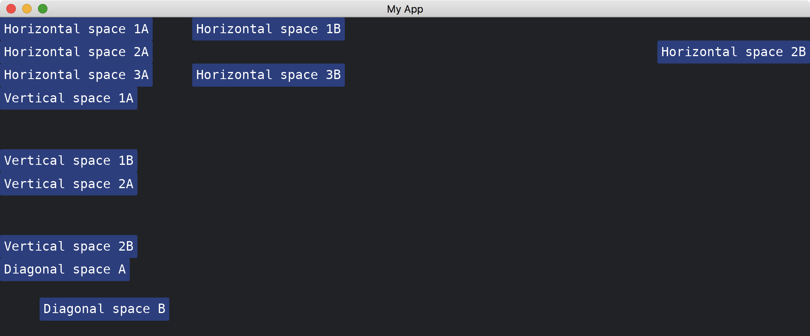

# Space

[Space](https://docs.rs/iced/0.12.1/iced/widget/space/struct.Space.html) is a convenient widget that helps us laying out our widgets.
It is an empty widget that occupies a space.
It has several constructions to help us allocating spaces horizontally, vertically or both.

```rust
use iced::{
    widget::{button, column, horizontal_space, row, vertical_space, Space},
    Alignment, Length, Sandbox, Settings,
};

fn main() -> iced::Result {
    MyApp::run(Settings::default())
}

struct MyApp;

impl Sandbox for MyApp {
    type Message = ();

    fn new() -> Self {
        Self
    }

    fn title(&self) -> String {
        String::from("My App")
    }

    fn update(&mut self, _message: Self::Message) {}

    fn view(&self) -> iced::Element<'_, Self::Message> {
        column![
            row![
                button("Horizontal space 1A"),
                Space::with_width(50),
                button("Horizontal space 1B"),
            ],

            row![
                button("Horizontal space 2A"),
                Space::with_width(Length::Fill),
                button("Horizontal space 2B"),
            ],

            row![
                button("Horizontal space 3A"),
                horizontal_space(),
                button("Horizontal space 3B"),
            ],

            button("Vertical space 1A"),
            Space::with_height(50),
            button("Vertical space 1B"),
            Space::with_height(Length::Fill),
            button("Vertical space 2A"),
            vertical_space(),
            button("Vertical space 2B"),
            
            button("Diagonal space A"),
            row![Space::new(50, 50), button("Diagonal space B"),].align_items(Alignment::End)
        ]
        .into()
    }
}
```



:arrow_right:  Next: [Container](./container.md)

:blue_book: Back: [Table of contents](./../README.md)
