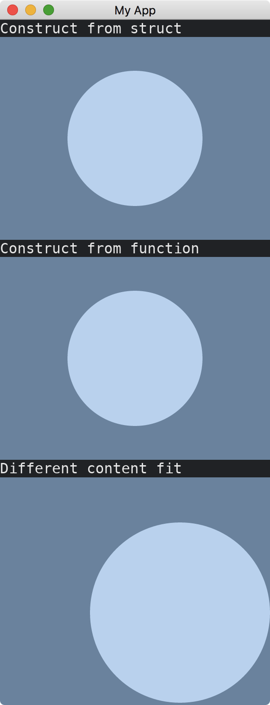

# Svg

The [Svg](https://docs.iced.rs/iced/widget/svg/struct.Svg.html) widget is able to display an [SVG](https://en.wikipedia.org/wiki/SVG) image.
It has two methods of constructions.
We can set how to fit the image content into the widget bounds.

To use the widget, we have to enable the [svg](https://docs.rs/crate/iced/latest/features#svg) feature.
The `Cargo.toml` dependencies should look like this:

```toml
[dependencies]
iced = { version = "0.10.0", features = ["svg"] }
```

Let's add an [SVG](https://en.wikipedia.org/wiki/SVG) image named `pic.svg` into the project root directory, i.e., the image has the path `my_project/pic.svg` where `my_project` is the name of our project.
The file `pic.svg` contains the following content:

```svg
<svg viewBox="0 0 400 300" xmlns="http://www.w3.org/2000/svg">
    <rect width="400" height="300" style="fill:rgb(100,130,160)"/>
    <circle cx="200" cy="150" r="100" style="fill:rgb(180,210,240)"/>
</svg>
```

Our example is as follows:

```rust
use iced::{
    widget::{column, svg, svg::Handle, text, Svg},
    ContentFit, Sandbox, Settings,
};

fn main() -> iced::Result {
    MyApp::run(Settings::default())
}

struct MyApp;

impl Sandbox for MyApp {
    type Message = ();

    fn new() -> Self {
        Self
    }

    fn title(&self) -> String {
        String::from("My App")
    }

    fn update(&mut self, _message: Self::Message) {}

    fn view(&self) -> iced::Element<'_, Self::Message> {
        column![
            text("Construct from struct"),
            Svg::from_path("pic.svg"),
            text("Construct from function"),
            svg(Handle::from_path("pic.svg")),
            text("Different content fit"),
            Svg::from_path("pic.svg").content_fit(ContentFit::None),
        ]
        .into()
    }
}
```



:arrow_right:  Next: [Width And Height](./width_and_height.md)

:blue_book: Back: [Table of contents](./../README.md)
