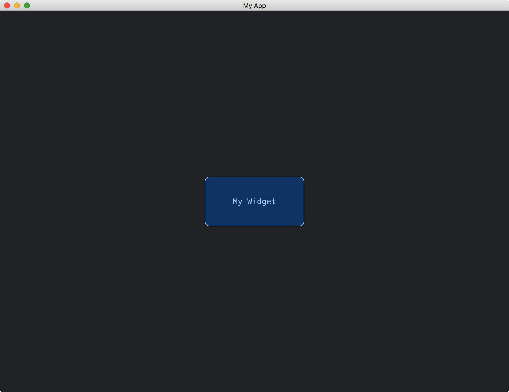

# Texts In Widgets

In addition to draw a [Quad](https://docs.rs/iced/latest/iced/advanced/renderer/struct.Quad.html), we can also draw texts in our widgets.

For example, suppose we would like to draw a string slice named `CONTENT`.

```rust
struct MyWidgetWithText;

impl MyWidgetWithText {
    const CONTENT: &'static str = "  My Widget  ";

    fn new() -> Self {
        Self
    }
}
```

We use the build-in [draw](https://docs.rs/iced/latest/iced/widget/text/fn.draw.html) function to draw the text.

```rust
fn draw(
    &self,
    _state: &Tree,
    renderer: &mut Renderer,
    _theme: &Renderer::Theme,
    style: &renderer::Style,
    layout: Layout<'_>,
    _cursor: mouse::Cursor,
    _viewport: &Rectangle,
) {
    renderer.fill_quad(
        Quad {
            bounds: layout.bounds(),
            border_radius: 10.0.into(),
            border_width: 1.0,
            border_color: Color::from_rgb(0.6, 0.8, 1.0),
        },
        Color::from_rgb(0.0, 0.2, 0.4),
    );

    iced::widget::text::draw(
        renderer,
        style,
        layout,
        Self::CONTENT,
        None,
        Default::default(),
        None,
        iced::widget::text::Appearance {
            color: Some(Color::from_rgb(0.6, 0.8, 1.0)),
        },
        alignment::Horizontal::Center,
        alignment::Vertical::Center,
        Default::default(),
    );
}
```

The [draw](https://docs.rs/iced/latest/iced/widget/text/fn.draw.html) function needs the `Renderer` to implement [iced::advanced::text::Renderer](https://docs.rs/iced/latest/iced/advanced/text/trait.Renderer.html).
Thus we have to require this in our [Widget](https://docs.rs/iced/latest/iced/advanced/widget/trait.Widget.html) implementation.

```rust
impl<Message, Renderer> Widget<Message, Renderer> for MyWidgetWithText
where
    Renderer: iced::advanced::Renderer + iced::advanced::text::Renderer,
```

Furthermore, we can use the [Text](https://docs.rs/iced/latest/iced/widget/type.Text.html) widget to help us determining the [layout](https://docs.rs/iced/latest/iced/advanced/widget/trait.Widget.html#tymethod.layout) of our widget.

```rust
fn layout(&self, renderer: &Renderer, limits: &layout::Limits) -> layout::Node {
    let text = iced::widget::Text::new(Self::CONTENT);
    let text = &text as &dyn Widget<Message, Renderer>;

    text.layout(renderer, limits)
}
```

This require the `Renderer` to have an associated type `Theme` that implements [iced::widget::text::StyleSheet](https://docs.rs/iced/latest/iced/widget/text/trait.StyleSheet.html).

```rust
impl<Message, Renderer> Widget<Message, Renderer> for MyWidgetWithText
where
    Renderer: iced::advanced::Renderer + iced::advanced::text::Renderer,
    Renderer::Theme: iced::widget::text::StyleSheet,
```

The full code is as follows:

```rust
use iced::{
    advanced::{
        layout, mouse,
        renderer::{self, Quad},
        widget::Tree,
        Layout, Widget,
    },
    alignment,
    widget::container,
    Color, Element, Length, Rectangle, Sandbox, Settings,
};

fn main() -> iced::Result {
    MyApp::run(Settings::default())
}

struct MyApp;

impl Sandbox for MyApp {
    type Message = ();

    fn new() -> Self {
        Self
    }

    fn title(&self) -> String {
        String::from("My App")
    }

    fn update(&mut self, _message: Self::Message) {}

    fn view(&self) -> iced::Element<'_, Self::Message> {
        container(MyWidgetWithText::new())
            .width(Length::Fill)
            .height(Length::Fill)
            .center_x()
            .center_y()
            .into()
    }
}

struct MyWidgetWithText;

impl MyWidgetWithText {
    const CONTENT: &'static str = "  My Widget  ";

    fn new() -> Self {
        Self
    }
}

impl<Message, Renderer> Widget<Message, Renderer> for MyWidgetWithText
where
    Renderer: iced::advanced::Renderer + iced::advanced::text::Renderer,
    Renderer::Theme: iced::widget::text::StyleSheet,
{
    fn width(&self) -> Length {
        Length::Shrink
    }

    fn height(&self) -> Length {
        Length::Shrink
    }

    fn layout(&self, renderer: &Renderer, limits: &layout::Limits) -> layout::Node {
        let text = iced::widget::Text::new(Self::CONTENT);
        let text = &text as &dyn Widget<Message, Renderer>;

        text.layout(renderer, limits)
    }

    fn draw(
        &self,
        _state: &Tree,
        renderer: &mut Renderer,
        _theme: &Renderer::Theme,
        style: &renderer::Style,
        layout: Layout<'_>,
        _cursor: mouse::Cursor,
        _viewport: &Rectangle,
    ) {
        renderer.fill_quad(
            Quad {
                bounds: layout.bounds(),
                border_radius: 10.0.into(),
                border_width: 1.0,
                border_color: Color::from_rgb(0.6, 0.8, 1.0),
            },
            Color::from_rgb(0.0, 0.2, 0.4),
        );

        iced::widget::text::draw(
            renderer,
            style,
            layout,
            Self::CONTENT,
            None,
            Default::default(),
            None,
            iced::widget::text::Appearance {
                color: Some(Color::from_rgb(0.6, 0.8, 1.0)),
            },
            alignment::Horizontal::Center,
            alignment::Vertical::Center,
            Default::default(),
        );
    }
}

impl<'a, Message, Renderer> From<MyWidgetWithText> for Element<'a, Message, Renderer>
where
    Renderer: iced::advanced::Renderer + iced::advanced::text::Renderer,
    Renderer::Theme: iced::widget::text::StyleSheet,
{
    fn from(widget: MyWidgetWithText) -> Self {
        Self::new(widget)
    }
}
```



<!-- :arrow_right:  Next:  -->

:blue_book: Back: [Table of contents](./../README.md)
