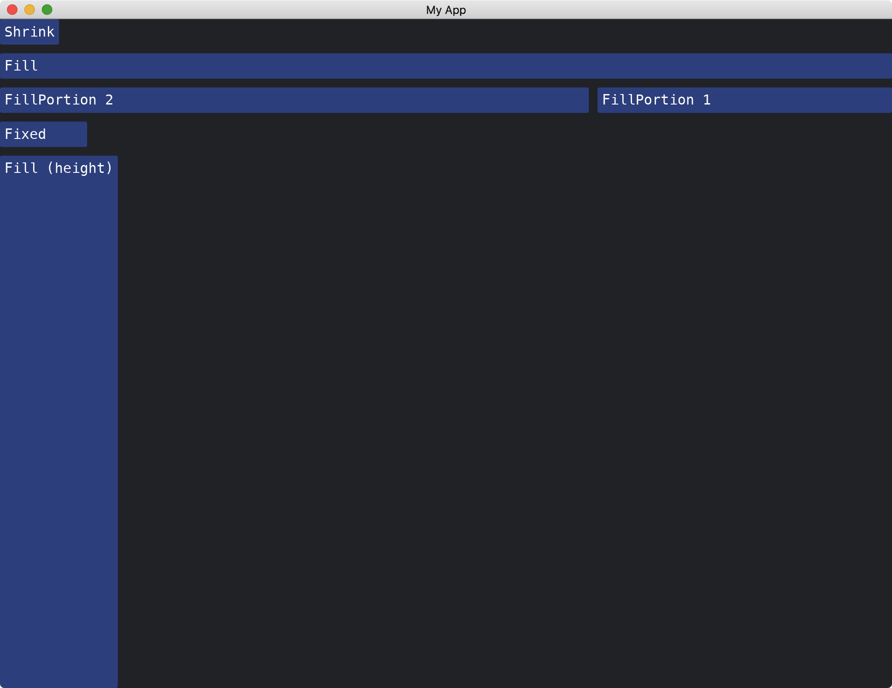

# Width And Height

Most widgets have the `width` and `height` methods to control their sizes.
The methods accept a parameter [Length](https://docs.rs/iced/0.12.1/iced/latest/iced/enum.Length.html).
There are four types of [Length](https://docs.rs/iced/0.12.1/iced/latest/iced/enum.Length.html):

* [Shrink](https://docs.rs/iced/0.12.1/iced/latest/iced/enum.Length.html#variant.Shrink): occupy the least space.
* [Fill](https://docs.rs/iced/0.12.1/iced/enum.Length.html#variant.Fill): occupy all the rest of space.
* [FillPortion](https://docs.rs/iced/0.12.1/iced/enum.Length.html#variant.FillPortion): occupy the space relative to other widgets with [FillPortion](https://docs.rs/iced/0.12.1/iced/enum.Length.html#variant.FillPortion).
* [Fixed](https://docs.rs/iced/0.12.1/iced/enum.Length.html#variant.Fixed): occupy a fixed space.

```rust
use iced::{
    widget::{button, column, row},
    Element, Length,
};

fn main() -> iced::Result {
    iced::run("My First App", MyApp::update, MyApp::view)
}

struct MyApp {
    _state: String,
}

impl Default for MyApp {
    fn default() -> Self {
        MyApp::new()
    }
}

#[derive(Debug, Clone)]
enum Message {
    _Message1,
}

impl MyApp {
    fn new() -> Self {
        Self {
            _state: String::new(),
        }
    }
  
    fn update(&mut self, _message: Message) {
        todo!()
    }
  
    fn view(&self) -> Element<Message> {
        column!(
            button("Shrink").width(Length::Shrink),
            button("Fill").width(Length::Fill),
            row![
                // (ROW - 10%) * 2 / 3
             button("FillPortion2").width(Length::FillPortion(2)),
                // (ROW - 10%) * 1 / 3
             button("FillPortion1").width(Length::FillPortion(1)),
            ]
            .spacing(10),
            button("Fixed").width(Length::Fixed(100.)),
            button("Fill(height)").height(Length::Fill),
        )
        .spacing(10)
        .into()
    }
}
```



:arrow_right:  Next: [Column](./column.md)

:blue_book: Back: [Table of contents](./../README.md)
